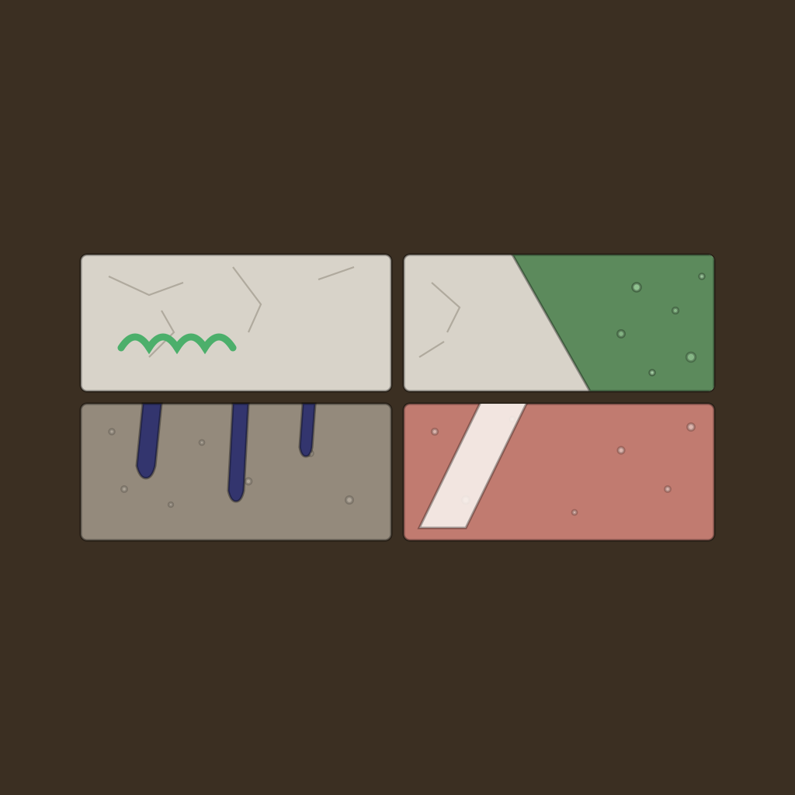

# Doped Goal

<p align="center">
  
</p>

A goal is a wall. A task is a brick. Finishing a task places its brick, and
finishing every task fills the wall.

Built for ADHD users: progress is additive, nothing decays, no streak can break,
and no brick is ever lost.

The app lives in [`flutter/`](flutter/) — a Flutter app implementing the
"Halftone Goals" design (Goals, History, Profile, Create Goal, Goal Detail).

## Documentation

- [`CONTRIBUTING.md`](CONTRIBUTING.md) — commit conventions, CI expectations

## Build

Requires the Flutter SDK (see [`flutter/.metadata`](flutter/.metadata) for the
pinned channel/version).

```bash
cd flutter
flutter pub get        # dependencies
flutter analyze         # static analysis
flutter test             # unit + widget tests
flutter build apk --debug   # build an installable debug APK
```

## Releases

Every push to `main` that touches `flutter/**` builds a debug APK through
[`build-apk.yml`](.github/workflows/build-apk.yml), uploads it as a build
artifact, and tags + publishes it as a GitHub release. Nothing about the
version is maintained by hand.

| | Source | Why |
| --- | --- | --- |
| `versionCode` | `git rev-list --count HEAD` | Auto-increments per commit and is strictly monotonic. Android refuses to install an APK whose `versionCode` is not greater than the installed one, so every build is sideloadable over the last. |
| `versionName` | `flutter/version.properties`, `major.minor` | `versionMinor` auto-bumps on every push to `main`. `versionMajor` only changes via the manual [`bump-major-version.yml`](.github/workflows/bump-major-version.yml) workflow (Actions tab → Run workflow), which also resets minor to 0. |

The minor bump is persisted only after the APK builds and tests pass, as
`chore(flutter): bump version to vX.Y [skip ci]`. The `[skip ci]` marker is
load-bearing: without it that push would re-trigger the workflow and bump
forever.

Because the release bot pushes to `main`, your next local push can be rejected
as behind. Rebase onto it — the bot's commit touches `flutter/version.properties`
only.

### Signing

The APK is currently **debug-signed only** — installable for testing, not
distributable. No release keystore/signing story exists for this app yet.

## Status

Task completion (Goal Detail screen) and local persistence
(`shared_preferences`) are in place. The design's brick/wall rendering is a
simplified flat-color placeholder, not the generative halftone texture from
the original visual reference material — see `flutter/lib/widgets/wall_preview.dart`.
